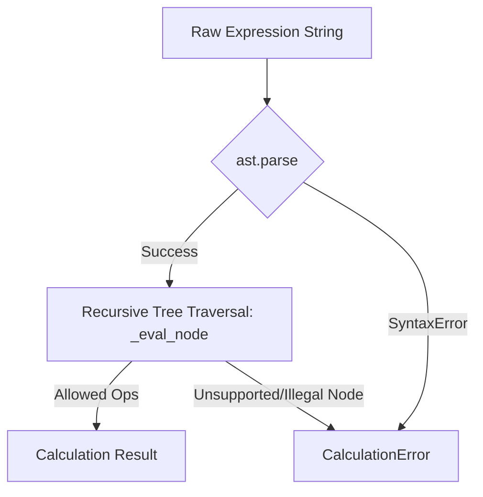

# Core Calculation Logic

The core logic of the calculator is encapsulated within the `Calculator` class, located in [repo://calc_app/core.py](repo://calc_app/core.py). It provides a secure, UI-agnostic engine for parsing and evaluating mathematical expressions.

## Expression Evaluation

To ensure both safety and flexibility, the calculator does not use `eval()` on raw input strings. Instead, it utilizes Python's built-in `ast` (Abstract Syntax Tree) module to parse expressions into a structured tree and then recursively evaluates the nodes.

### Evaluation Lifecycle

1.  **Preparation**: The expression is stripped of whitespace. An empty expression check is performed.
2.  **Parsing**: `ast.parse(expression, mode="eval")` is invoked. If the expression contains syntax errors (e.g., mismatched parentheses or invalid characters), a `CalculationError` is raised.
3.  **Recursive Traversal**: The `_eval_node` method traverses the generated AST tree. It explicitly validates each node type against a whitelist of allowed operations.
4.  **Application**: Binary operations and unary operations are applied using dedicated methods that check for runtime errors, such as division by zero.

## Supported Operations

The evaluator supports a subset of standard arithmetic operations to minimize security risks while maintaining calculator functionality:

*   **Literals**: Numeric values (integers and floats).
*   **Unary Operators**: `+` (positive), `-` (negative).
*   **Binary Operators**: `+` (addition), `-` (subtraction), `*` (multiplication), `/` (division), `%` (modulo), `**` (exponentiation).

## Error Handling

The system uses a custom `CalculationError` exception for all evaluation-related issues. This ensures that callers can differentiate between expected calculation domain errors (e.g., division by zero) and unexpected system-level errors.

*   **Division/Modulo by Zero**: Explicitly checked during binary operation application; raises `CalculationError`.
*   **Invalid Syntax**: Handled during the `ast.parse` stage.
*   **Unsupported Nodes**: Any AST node not explicitly white-listed in `_eval_node` (such as function calls or complex expressions) causes the evaluator to reject the expression.

## Helper Utilities

The `Calculator` class also provides utility methods for UI interactions:

*   **`toggle_sign(value: str)`**: Manipulates the string representation of a number to add or remove a negative sign.
*   **`backspace(value: str)`**: Safely removes the last character from the current input string.
