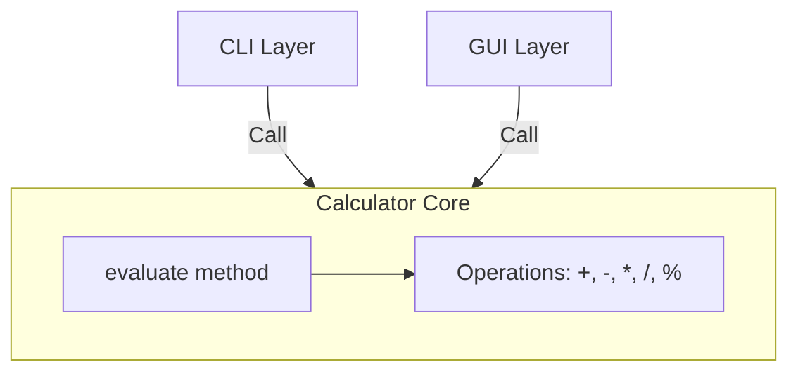

# Architecture Overview

The calculator application is designed with a clear separation between business logic and presentation layers. This decoupled architecture allows the application to support multiple interfaces (CLI and GUI) while sharing a single, robust arithmetic core.

## System Components

### 1. Core Logic (`calc_app/core.py`)
The `Calculator` class acts as the system's engine. It is responsible for parsing arithmetic expressions and performing calculations using Python's `ast` (Abstract Syntax Tree) module to ensure safe evaluation. It is completely independent of any input or output mechanisms, making it portable and testable in isolation.

### 2. User Interfaces
The application provides two entry points that interact with the `Calculator` core:

*   **CLI (`calc_app/cli.py`)**: A command-line interface that accepts expressions as arguments and prints the results directly to the standard output.
*   **GUI (`calc_app/ui.py`)**: A graphical user interface built with `tkinter`. It provides a visual calculator keypad and display area, mapping button events to the `Calculator` core methods.

## Component Interaction

The following diagram illustrates how the interface layers communicate with the `Calculator` core:

## Data Flow and Control

1.  **Input Collection**: User input is captured via the interfaces (`argparse` in CLI or `tkinter.Entry` widgets in the GUI).
2.  **Expression Processing**: The UI/CLI layer passes the raw input string to the `Calculator.evaluate()` method.
3.  **Safe Evaluation**: The core utilizes `ast.parse` to convert the string into an AST, walks the tree to evaluate nodes, and returns the result as a float.
4.  **Error Handling**: If the input is invalid or a mathematical error occurs (e.g., division by zero), the core raises a `CalculationError`, which the interface layers catch and display to the user appropriately.
5.  **Output**: The resulting value is formatted (e.g., stripping unnecessary decimals for integers) and presented to the user.
