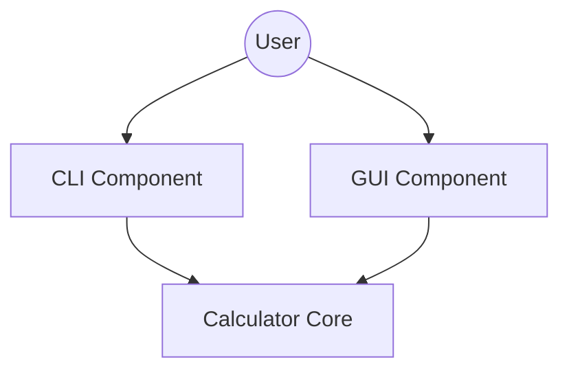

The calculator application provides two distinct user interfaces that interact with the core calculation logic: a command-line interface (CLI) and a graphical user interface (GUI). 

The CLI and UI modules are separated to ensure that each interface environment (terminal vs. desktop window) handles its own lifecycle, input events, and display requirements independently, while relying on the `Calculator` core for all computational heavy-lifting.

## CLI Component
The CLI is implemented in `calc_app/cli.py` and serves as a thin wrapper over the `Calculator` core.

*   **Responsibilities**:
    *   **Input Parsing**: Uses `argparse` to capture arithmetic strings from terminal arguments.
    *   **Execution**: Instantiates `Calculator` to evaluate expressions.
    *   **Output**: Renders results to standard output and manages process-level exit status on `CalculationError`.
*   **Key File**: `calc_app/cli.py`.

## GUI Component
The GUI is implemented in `calc_app/ui.py` using `tkinter`. It provides a persistent windowed environment with an interactive display.

*   **Responsibilities**:
    *   **Lifecycle Management**: `CalculatorApp` manages the Tkinter main loop and UI state.
    *   **Interaction Logic**: Maps user clicks (buttons/keys) to updates in the display buffer and calls `Calculator` methods for auxiliary operations like `backspace()` or `toggle_sign()`.
    *   **Display Formatting**: Handles translation between the `Calculator` float outputs and the GUI display text.
*   **Key File**: `calc_app/ui.py`.

## Relationships and Control Flow
Both interfaces follow a separation of concerns where UI modules manage events and presentation, while the `Calculator` class in `calc_app/core.py` encapsulates calculation, validation, and expression state management.

