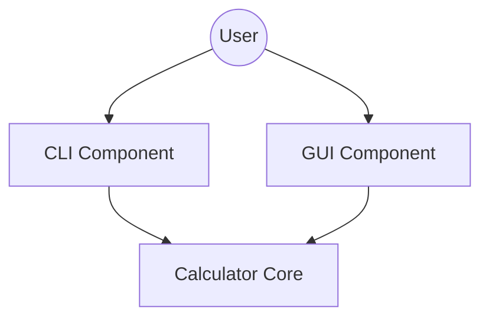

The calculator application provides two distinct user interfaces that interact with the core calculation logic: a command-line interface (CLI) and a graphical user interface (GUI). Both interfaces serve as thin wrappers around the `Calculator` core logic, handling input parsing, error reporting, and display formatting.

## CLI Component

The CLI is implemented in `calc_app/cli.py` and provides a simple, direct way to evaluate arithmetic expressions from a terminal.

*   **Entrypoint**: The `main()` function uses the standard library `argparse` module to capture an arithmetic string argument.
*   **Interaction**: It instantiates the `Calculator` class and invokes the `evaluate()` method.
*   **Error Handling**: It catches `CalculationError` exceptions from the core logic and exits the process with a non-zero status, printing the error message.
*   **Formatting**: The CLI checks if the result is an integer to format the output appropriately before printing to standard output.

## GUI Component

The GUI is implemented in `calc_app/ui.py` using Python's `tkinter` library. It provides a persistent window for interactive calculation.

*   **Implementation**: The `CalculatorApp` class manages the lifecycle of the Tkinter window, the entry display, and the button layout.
*   **State Interaction**: Each GUI interaction (like clicking a digit or an operation button) updates an internal text buffer, while specialized buttons (like "=") trigger the core logic.
*   **Logic Integration**:
    *   **Evaluation**: The `_calculate()` method extracts the current string from the display and passes it to the `Calculator.evaluate()` method.
    *   **Auxiliary Operations**: Features like backspacing or toggling the sign of a number are handled by dedicated methods in `CalculatorApp` that delegate to `Calculator.backspace()` or `Calculator.toggle_sign()`.
    *   **Formatting**: The GUI includes a helper method `_format_result()` to ensure integers are displayed as whole numbers rather than floats.

## Relationships and Control Flow

Both interfaces strictly follow a separation of concerns where the user interface handles event loops and input formatting, while the `Calculator` class in `calc_app/core.py` manages the actual evaluation logic.

