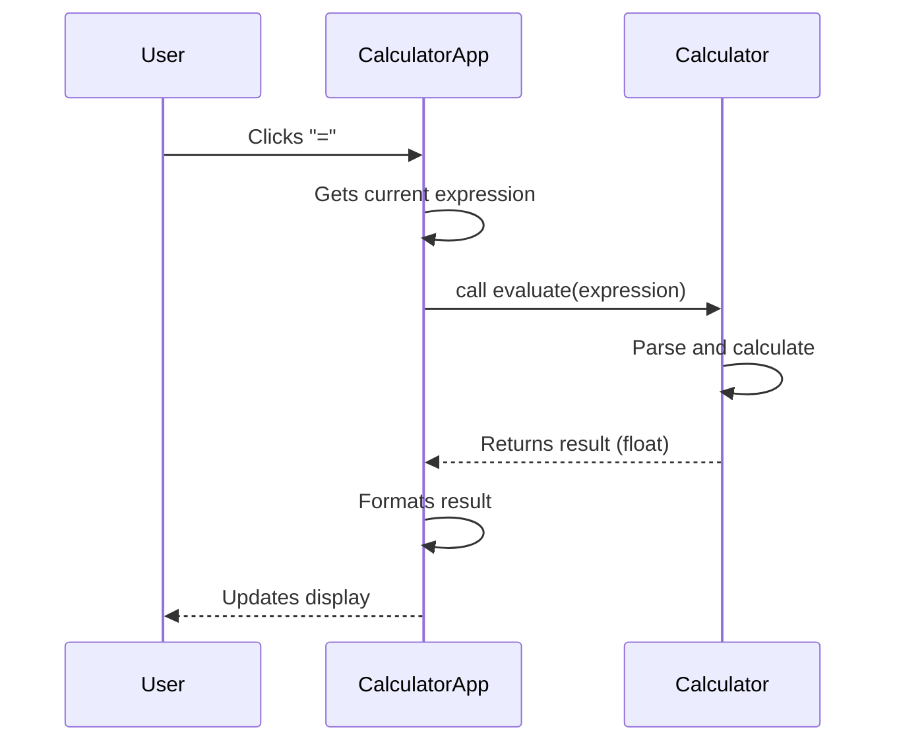

# Feature Addition Guide

To safely introduce new features to the calculator, follow these patterns to maintain the separation between the arithmetic engine and the graphical interface.

## Architectural Boundaries

The application is structured to isolate business logic from UI concerns:

*   **`Calculator` (Core Logic)**: Located in `repo://calc_app/core.py`. The `Calculator` class provides an independent arithmetic engine using Python's `ast` module, intentionally decoupled from the GUI. It is responsible for expression parsing, arithmetic evaluation, and state transformations. It has no dependency on `tkinter`.
*   **`CalculatorApp` (UI)**: Located in `repo://calc_app/ui.py`. Manages the `tkinter` window, event bindings, and display state. It delegates mathematical operations to the `Calculator`.

## Workflow for Extending Features

### 1. Extending Core Logic
If the new feature is a mathematical operation (e.g., exponentiation) or a state-manipulation utility:

1.  **Update `Calculator`**: Modify `repo://calc_app/core.py`.
2.  **Update `evaluate`**: If it is a new operator, update the `_eval_node` recursive parser and `_apply_binary_operator` method.
3.  **Ensure Safety**: Always validate inputs. The `evaluate` method uses `ast.parse` to convert strings into a safe, restricted AST, protecting against arbitrary code execution by only permitting specific nodes (literals, unary operations, binary operations).
4.  **Testing**: Verify the logic using standalone unit tests that instantiate `Calculator` without requiring a UI.

### 2. Extending the User Interface
If the new feature adds visual interaction or a new button:

1.  **Update `CalculatorApp`**: Modify `repo://calc_app/ui.py`.
2.  **Define Action**: If the button triggers core logic, call the `Calculator` instance (`self.calculator`).
3.  **Update `_build_buttons`**: Add the new `tk.Button` to the `button_frame` grid.
4.  **Formatting**: If the feature produces a new type of output, update `_format_result` to handle the display representation properly.

## Recommended Control Flow

The following diagram illustrates how the components interact during a standard calculation:

## Maintenance Invariants

*   **Exceptions**: When core logic fails, raise `CalculationError` from `repo://calc_app/core.py`. The UI is designed to catch this and display "Error". Never leak internal Python exceptions directly to the user.
*   **Decoupling**: Keep `core.py` free of `tkinter` imports. This allows for easier testing and potential future ports to other UI frameworks (like CLI or web).
